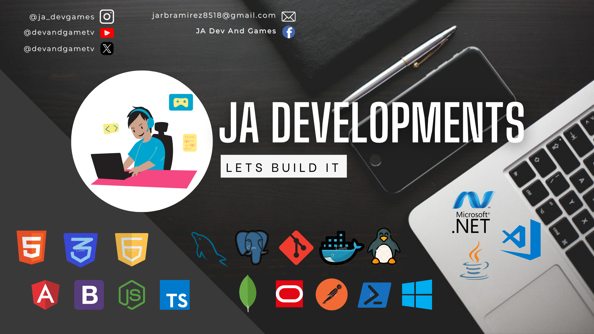

#   Hi 👋, Welcome to JA Dev And Games' GitHub!!!

  

## About me

I'm a systems engineer with over nine years 
of experience developing full-stack solutions. Expert in .Net, Java, Angular, JavaScript, SQL and NoSQL databases and cloud solutions, committed to best 
practices.

This is my community, where you can find some tutorials about how to develop web apps, websites, web services, Rest APIs, desktop apps, Backend, frontend, ETLs, Data bases, Operative Systems and others.

## Skills - Tools - Experience

&nbsp;&nbsp;
&nbsp;&nbsp;
&nbsp;&nbsp;
&nbsp;&nbsp;
&nbsp;&nbsp;

## Repositories' Statistics

## Trophies

<!--
**jadevandgames8518/jadevandgames8518** is a ✨ _special_ ✨ repository because its `README.md` (this file) appears on your GitHub profile.

Here are some ideas to get you started:

- 🔭 I’m currently working on ...
- 🌱 I’m currently learning ...
- 👯 I’m looking to collaborate on ...
- 🤔 I’m looking for help with ...
- 💬 Ask me about ...
- 📫 How to reach me: ...
- 😄 Pronouns: ...
- ⚡ Fun fact: ...
-->
